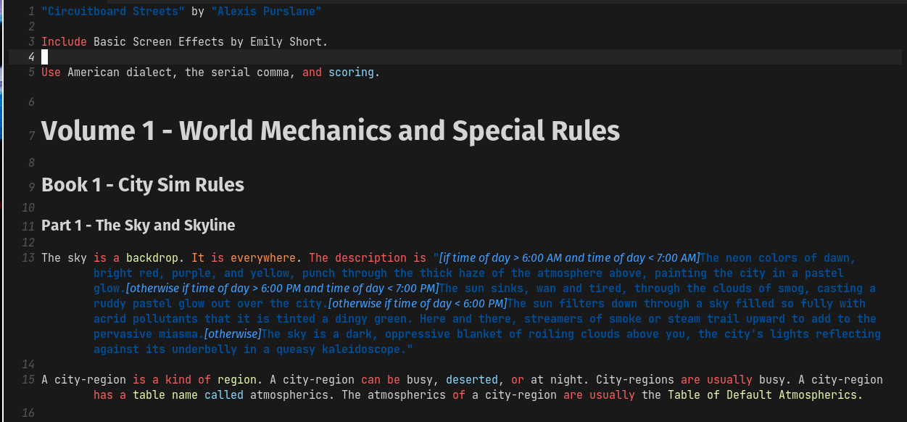
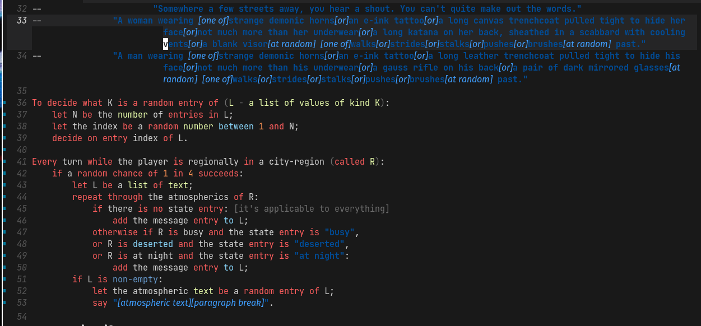
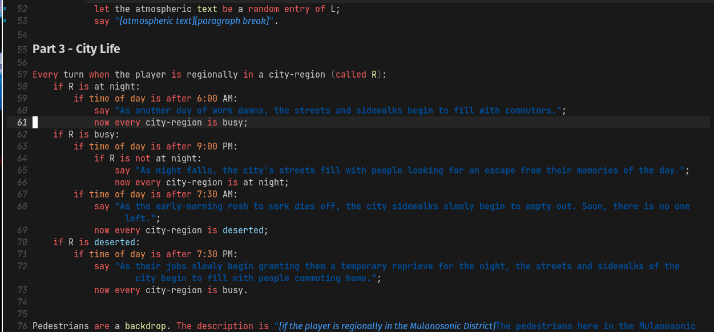

# inform7-mode

This Inform 7 Emacs mode is a heavy modification (about 800 lines longer) by
Alexis Purslane on @GuiltyDolphin's work. The primary focus of my changes has
been on adding more syntax higlighting. Previously, the mode basically only
highlighted strings, substitutions within strings, headings, and the built in
rulebook names. Now, this plugin highlights all the keywords and keyphrases that
Inform 7 uses to determine what you want to do, as well as all of the built in
types, adjectives, and rulebooks. I've also ported almost all of the old regexes
into the new `rx` emacs lisp syntax, which I used to do everything else as well.

This extra syntax highlighting represents, I believe, an substantial actual
improvement in the ease of using Inform 7, since now you have some feedback as
to what phrases are actually correct syntax and what aren't --- otherwise, since
Inform 7 tries to adhere to natural English as much as possible, there would be
no way to distinguish between gramatically correct and sensible English that
Inform *does* know how to parse, and similarly gramatically correct and sensible
English that it doesn't, since all gramattically correct English would
theoretically look just as valid.

In addition, I've applied some simple heuristics to have the plugin actually
highlight parts of speech, like adjectives and past tense verbs, in an attempt
to help you further.

## What is Inform?

Inform 7 is a language for writing interactive fiction in a
natural-language style.

You can find the Inform 7 homepage at http://inform7.com, which includes
instructions on how to set up Inform for various systems (Arch users: if you
want a GUI, you'll want to check out [this AUR
package](https://aur.archlinux.org/packages/gnome-inform7/)).

## Screenshots

